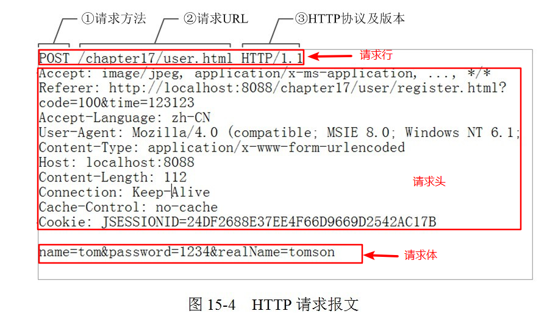
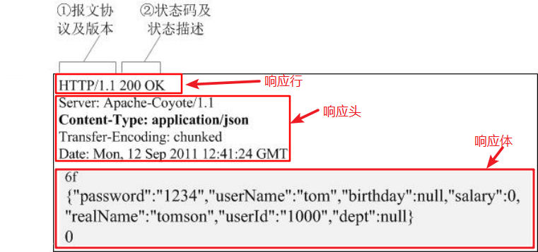
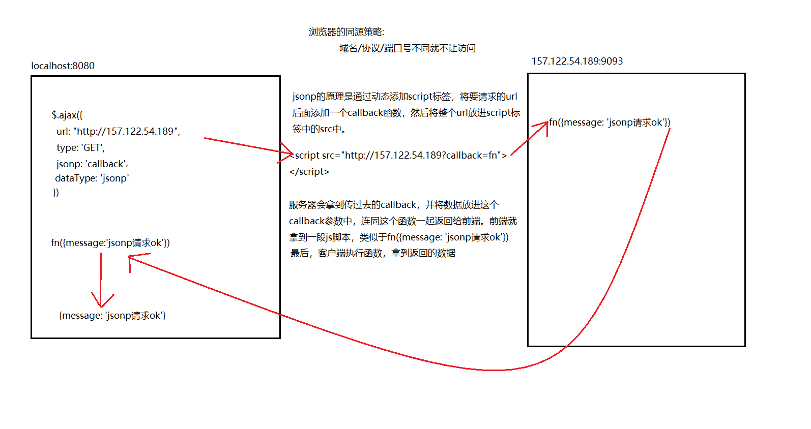
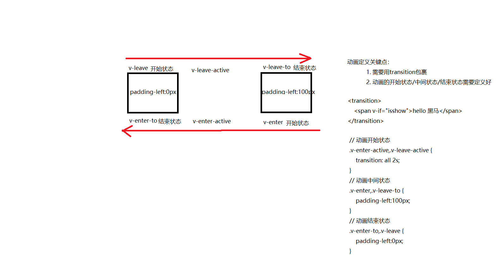

Vue基础-day02
===
<!-- TOC -->

- [computed](#computed)
- [watch](#watch)
- [案例-利用系统指令实现品牌案例管理](#案例-利用系统指令实现品牌案例管理)
  - [功能-实现品牌列表数据过滤功能](#功能-实现品牌列表数据过滤功能)
  - [功能-利用vue的动画实现删除提示框动画呈现和离开](#功能-利用vue的动画实现删除提示框动画呈现和离开)
- [axios(基于 promise 的 HTTP 库)](#axios基于-promise-的-http-库)
  - [get请求示例](#get请求示例)
  - [post请求示例](#post请求示例)
- [案例-品牌管理API](#案例-品牌管理api)
- [案例-axios版获取及删除数据](#案例-axios版获取及删除数据)
- [vue-resource(不推荐使用)](#vue-resource不推荐使用)
- [vue过渡&动画](#vue过渡动画)
  - [transition的作用](#transition的作用)
  - [transition结合css实现过渡](#transition结合css实现过渡)
  - [transition结合animate.css实现过渡](#transition结合animatecss实现过渡)
  - [transition结合钩子函数实现过渡](#transition结合钩子函数实现过渡)

<!-- /TOC -->

## computed

计算属性出现的目的是解决模板中放入过多的逻辑会让模板过重且难以维护的问题；计算属性是基于它们的依赖进行缓存的

```js
    computed: {
      fullName: function () {
        console.log(this.firstName + this.lastName)
        return this.firstName + this.lastName
      }
    }
```

## watch

侦听器（watch）用来观察和响应 Vue 实例上的数据变动

```js
  watch: {
    firstName: function (val) {
      this.fullName = val + ' ' + this.lastName
    },
    lastName: function (val) {
      this.fullName = this.firstName + ' ' + val
    }
  }
```

注意：通常情况下用computed，当需要在数据变化时**执行异步**或**开销较大**的操作时，用watch

## 案例-利用系统指令实现品牌案例管理

### 功能-实现品牌列表数据过滤功能

利用两种方式实现：
1. watch 监听器

```js
1. 在data(){}中定义searchvalue变量，作为存储用户是输入搜索值
   new Vue({
        // vm控制的区块为id为app的div，此div中的所有vue指令均可以被vm解析
        el: '#app',
        data: {
            searchvalue:''
             listold:[
                {id:1,name:'宝马',ctime:Date()},
                {id:2,name:'奔驰',ctime:Date()}
            ],
             list:[
                {id:1,name:'宝马',ctime:Date()},
                {id:2,name:'奔驰',ctime:Date()}
            ]
          },
           methods: {
            adddata(){
                this.product.ctime = Date();
                this.list.push(this.product);
                this.product = {id:0,name:'',ctime:Date()};
                // 为了防止搜索出来的新数组覆盖list，需要利用listold来存储一个list中完整的值
                this.listold = this.list;
            }
        },
        });


2. 双向数据绑定searchvalue
<div class="add">
    品牌名称:<input type="text" v-model="searchvalue" placeholder="请输入搜索条件">
</div>

3. 在watch中监控searchvalue变量的值，当值有改变，则触发方法searchvalue
new Vue({
  watch:{
          // 监控searchvalue变量的值，当值有改变，则触发方法
          // newval:searchvalue变量改变以后的值
          //oldval:searchvalue变量改变之前的值
            'searchvalue':function(newval,oldval){
              // 为了防止搜索出来的新数组覆盖list，需要利用listold来存储一个list中完整的值
                this.list=  this.listold.filter(item=>item.name.indexOf(newval)!=-1);
            }
        }
    });
```

2. computed 计算属性

```js
1. 在data(){}中定义searchvalue变量，作为存储用户是输入搜索值,利用computed定义计算属性来实现按照条件筛选数据逻辑
new Vue({
        // vm控制的区块为id为app的div，此div中的所有vue指令均可以被vm解析
        el: '#app',
        data: {
            searchvalue:''
          },
        computed:{
          listdata(){
              return this.list.filter(item=>item.name.indexOf(this.searchvalue)!=-1);
          }
        }
        });

2. 在v-for中遍历计算属性listdata数组中的值
 <tr v-for="item in listdata" :key="item.id">

由计算属性的特点可以知道：当改变了list数组中的值以后，会自动触发计算属性listdata的执行，从而更新v-for对于的列表
```

### 功能-利用vue的动画实现删除提示框动画呈现和离开

  [transition官方文档](https://cn.vuejs.org/v2/guide/transitions.html)

  1. transition结合css实现

  ```html
      // 1. 用transition组件包裹需要添加过渡的元素，并添加name属性
      <transition name="slide">
          <span v-if="isshow">hello 黑马</span>
      </transition>

      // 2. 定义以slide开头的css类
      <style>
        /* 控制整个动画的执行过程 */
        .slide-enter-active,.slide-leave-active {
            transition: all 2s;
        }

        /* 设定动画出现的起始位置和动画离开的结束位置 */
        .slide-enter,.slide-leave-to {
            padding-left:100px;
        }

       /* 设定动画离开的起始位置，和动画进入的结束位置 */
        .slide-enter-to,.slide-leave {
            padding-left:0px;
        }
      </style>

      // 3. 在点击事件中控制元素显示与隐藏
      <button @click="toggleShow">显示/隐藏</button>

      // 4. 定义一个isshow变量，用来控制元素显示或隐藏，并在点击事件中改变它的值
      // 实例化vue对象（MVVM中的View Model）
      new Vue({
          // vm控制的区块为id为app的div，此div中的所有vue指令均可以被vm解析
          el: '#app',
          data: {
              // 数据 （MVVM中的Model）   
              isshow: false
          },
          methods: {
              toggleShow: function () {
                  this.isshow = !this.isshow;
              }
          }
      })
  ```

  2. transition结合animate.css实现

  ```html
    // 1. 导入animate.css

    // 2. 使用
    <link rel="stylesheet" href="./animate.css">
    <transition
      enter-active-class="animated fadeInRight" 
      leave-active-class="animated fadeOutRight"
      >

    <span style="display:block;width:300px;" v-if="isshow">hello 黑马</span>
    </transition>

    // 利用methods中的方法去控制data中的isshow属性，实现元素的显示与隐藏
  ```

  3. transition结合动画钩子函数实现

  > 注意:enter和leave钩子中，当动画结束一定要调用done()函数，不然后续钩子函数不会被调用

  ```html
  <body>
      <div id="app">
          <button @click="showhide">显示/隐藏</button>
          <br />

          <!-- 2.0 在想要进行动画的元素上使用 <transition>标签包住
              transition: 
              动画进入事件：
              @before-enter
              @enter
              @after-enter
              -->
          <transition 
              @before-enter="beforeEnter" 
              @enter="enter" 
              @after-enter="afterEnter"
          >
              <span class="show" v-if="isshow">hello 黑马</span>
          </transition>
      </div>

  </body>

  <script>
      // 实例化vue对象（MVVM中的View Model）
      new Vue({
          // vm控制的区块为id为app的div，此div中的所有vue指令均可以被vm解析
          el: '#app',
          data: {
              // 数据 （MVVM中的Model）   
              isshow: false
          },
          methods: {
              // 1.0 动画进入前
              beforeEnter: function (el) {
                  console.log('1.0 beforeEnter');

                  // 在这个方法中设定当前动画元素的起始位置
                  el.style = "padding-left:100px";
              },
              // 2.0 动画执行中
              // el:动画的元素dom对象
              // done:enter事件执行完以后的回调，执行了它之后，afterEnter事件才会执行
              enter: function (el, done) {
                  console.log('2.0 enter');

                  var step = 3;
                  var interval = setInterval(() => {
                      el.style.paddingLeft = (100 - step) + 'px';
                      step++;
                      if (parseInt(el.style.paddingLeft) <= 0) {
                          clearInterval(interval)
                          // 动画结束后必须执行done()函数
                          done()
                      }
                  }, 10)
              },
              // 3.0 动画执行完毕
              afterEnter: function (el) {
                  console.log('3.0 afterEnter');
                  // 将isshow重置为false即可
                  this.isshow = false;
              },
              showhide: function () {
                  this.isshow = !this.isshow;
              }
          }
      })
  </script>
  ```

## axios(基于 promise 的 HTTP 库)

  [axios文档](https://github.com/axios/axios)

1. http请求报文

    浏览器与服务器数据交互是遵循http协议的，当浏览器要访问服务器的时候，浏览器需要将相关请求数据提交给服务器（例如：浏览器信息，url地址，参数等），通常是通过请求报文来提交的

    * 请求报文的格式分为：
        1. 请求报文行
        2. 请求报文头
        3. 请求报文体

    

2. http响应报文

    当浏览器请求服务器的时候，服务器需要将数据返回给浏览器，这种数据是通过响应报文响应回浏览器的

    * 响应报文的格式分为：
        1. 响应报文行
        2. 响应报文头
        3. 响应报文体

    

### get请求示例

  ```js
    axios.get('/user?ID=12345')
      .then(function (response) {
          console.log(response);
      })
      .catch(function (error) {
          console.log(error);
      });

    // 或者
    axios.get('/user', {
        params: {
          ID: 12345
        }
      })
      .then(function (response) {
        console.log(response);
      })
      .catch(function (error) {
        console.log(error);
      });
  ```
  演示代码

  ```js
    methods: {
      getData: function () {
        var url = 'http://157.122.54.189:9093/api/getprodlist'
        axios.get(url)
          .then(res => {
            this.list = res.data.message
            console.log(this.list);
          })
          .catch(error => {
            console.log(error);
          })
      }
    }
  ```

### post请求示例

  ```js
    axios.post('/user', {
      firstName: 'Fred',
      lastName: 'Flintstone'
    })
    .then(function (response) {
      console.log(response);
    })
    .catch(function (error) {
      console.log(error);
    });
  ```
  演示代码

  ```js
    methods: {
      getData: function () {
        var url = 'http://157.122.54.189:9093/api/addproduct'
        axios.post(url, "name=hello")
          .then(res => {
            console.log(res);
          })
          .catch(error => {
            console.log(error);
          })
      }
    }
  ```

## 案例-品牌管理API

  
| 接口说明         | URL                                           | 请求方式 | 参数                | 成功返回                                                                                   | 失败返回                                                                              |
| ---------------- | --------------------------------------------- | -------- | ------------------- | ------------------------------------------------------------------------------------------ | ------------------------------------------------------------------------------------- |
| 获取品牌数据列表 | http://157.122.54.189:9093/api/getprodlist    | GET      | searchvalue（可选） | {"status": 0,"message": [{"id": 104772,"name": "LV","ctime": "2017-12-05T08:35:57.000Z"}]} | 未做处理                                                           |
| 添加品牌数据     | http://157.122.54.189:9093/api/addproduct     | POST     | name（必填）        | {"status": 0,"message": "新增品牌成功"}                                                    | 未做处理                                                                                     |
| 删除品牌数据     | http://157.122.54.189:9093/api/delproduct/:id | GET      | id（必填）          | {"status": 0, "message": "删除品牌数据ok"}                                                 | {"status": 1,"message": "ER_BAD_FIELD_ERROR: Unknown column 'xxx' in 'where clause'"} |

## 案例-axios版获取及删除数据

```html
<!DOCTYPE html>
<html lang="en">

<head>
  <meta charset="UTF-8">
  <meta name="viewport" content="width=device-width, initial-scale=1.0">
  <meta http-equiv="X-UA-Compatible" content="ie=edge">
  <title>Document</title>
  <script src="./vue2.js"></script>
  <script src="./axios.js"></script>
  <style>
    #app {
      width: 600px;
      margin: 10px auto;
    }

    .tb {
      border-collapse: collapse;
      width: 100%;
    }

    .tb th {
      background-color: #0094ff;
      color: white;
    }

    .tb td,
    .tb th {
      padding: 5px;
      border: 1px solid black;
      text-align: center;
    }

    .add {
      padding: 5px;
      border: 1px solid black;
      margin-bottom: 10px;
    }
  </style>
</head>

<body>
  <div id="app">
    <div class="add">
      编号:
      <input type="text"> 品牌名称:
      <input type="text">
      <input type="button" value="添加">
    </div>

    <div class="add">
      品牌名称:
      <input type="text" placeholder="请输入搜索条件">
    </div>

    <div>
      <table class="tb">
        <tr>
          <th>编号</th>
          <th>品牌名称</th>
          <th>创立时间</th>
          <th>操作</th>
        </tr>
        <tr v-for="(item, index) in list" :key="index">
          <td>{{item.id}}</td>
          <td>{{item.title}}</td>
          <td>{{item.ctime}}</td>
          <td>
              <button @click="deleteData(item.id)">删除</button>
          </td>
        </tr>
        <tr v-if="list.length<=0">
          <td colspan="4">没有品牌数据</td>
        </tr>
        <!-- 动态生成内容tr -->
      </table>
    </div>
  </div>
</body>
<script>
  var vm = new Vue({
    el: "#app",
    data: {
      list: []
    },
    mounted () {
      this.getList()
    },
    methods: {
      getList: function () {
        var url = 'http://157.122.54.189:9093/api/getprodlist'
        axios.get(url)
          .then(res => {
            this.list = res.data.message
          })
          .catch(error => {
            console.log(error);
          })
      },
      deleteData: function (id) {
        var url = 'http://157.122.54.189:9093/api/delproduct/'+id
        axios.get(url)
          .then(res => {
            this.getList()
          })
          .catch(error => {
            console.log(error);
          })
      }
    }
  })
</script>

</html>
```

## vue-resource(不推荐使用)

一个使用 XMLHttpRequest 或者 JSONP处理请求的vue插件

[vue-resource文档](https://github.com/pagekit/vue-resource)


* 书写步骤
  ```js
    1. 通过 https://cdn.jsdelivr.net/vue.resource/1.2.1/vue-resource.min.js 下载到vue-resource文件

    2. 在html页面中通过script标签导入vue-resource.min.js 文件后，就会自动的在Vue对象实例上初始化 $http

    3. 使用
    // 全局Vue构造器写法
        Vue.http.get('/someUrl', [options]).then(successCallback, errorCallback);
        Vue.http.post('/someUrl', [body], [options]).then(successCallback, errorCallback);

    // 在Vue实例中的写法
        this.$http.get('/someUrl', [options]).then(successCallback, errorCallback);
        this.$http.post('/someUrl', [body], [options]).then(successCallback, errorCallback);
  ```

* vue-resource get请求

```js
    写法格式：
    this.$http.get('请求的url', [可选参数对象，使用{}传参]).then(成功回调函数, 失败回调函数);

    成功回调函数参数对象主要属性说明：
    1. url ： 请求的原始url
    2. body： 响应报文体中的数据（我们通常用这个属性获取服务器返回的数据）
    3. 其他属性请看文档

    举例：
    this.$http.get('http://vuecms.ittun.com/api/getlunbo?id=1').then(function(res){console.log(res.body)}, function(err){//err是异常数据});
```

* vue-resource post请求

```js
    写法格式：
    this.$http.post('请求的url',[可选参数请求报文体对象body,使用{}传参], [可选参数对象，使用{}传参]).then(成功回调函数, 失败回调函数);

    成功回调函数参数对象主要属性说明：
    1. url ： 请求的原始url
    2. body： 响应报文体中的数据（我们通常用这个属性获取服务器返回的数据）
    3. 其他属性请看文档

    注意点：
    $http.post()方法中的第二个参数固定写成：{emulateJSON:true},否则可能造成服务器无法接收到请求报文体中的参数值

    举例：
    this.$http.post('http://vuecms.ittun.com/api/adddata?id=1'  //请求的url
    ,{content:'hello'}  //请求报文体中传入的参数对象，多个使用逗号分隔
    ,{emulateJSON:true}  //固定写法，保证服务器可以获取到请求报文体参数值
    ).then(function(res){console.log(res.body)}, function(err){//err是异常数据});
```

* vue-resource jsonp请求

  

```js
    jsonp请求主要用来解决ajax跨域请求问题，使用jsonp实现跨域首先要保证服务器api支持jsonp请求的格式

    写法格式：
    this.$http.jsonp('请求的url', [可选参数对象，使用{}传参]).then(成功回调函数, 失败回调函数);

    成功回调函数参数对象主要属性说明：
    1. url ： 请求的原始url
    2. body： 响应报文体中的数据（我们通常用这个属性获取服务器返回的数据）
    3. 其他属性请看文档

    举例：
    this.$http.jsonp('http://157.122.54.189:9093/jsonp').then(function(res){console.log(res.body)}, function(err){//err是异常数据});
```

## vue过渡&动画

  Vue 提供了 transition 的封装组件，在下列情形中，可以给任何元素和组件添加进入或离开的过渡
  * 条件渲染 (使用 v-if)
  * 条件展示 (使用 v-show)
  * 动态组件

### transition的作用

将需要添加过渡的元素用transition组件包裹起来，结合css或者js钩子函数就能实现该元素进入或者离开的动画效果

### transition结合css实现过渡

  ```html
      <style>
        /* 控制整个动画的执行过程 */
        .slide-enter-active,.slide-leave-active {
            transition: all 2s;
        }

        /* 设定动画出现的起始位置和动画离开的结束位置 */
        .slide-enter,.slide-leave-to {
            padding-left:100px;
        }

       /* 设定动画离开的起始位置，和动画进入的结束位置 */
        .slide-enter-to,.slide-leave {
            padding-left:0px;
        }
    </style>

    <transition name="slide">
        <span v-if="isshow">hello 黑马</span>
    </transition>
  ```
  动画图解<br />
  

### transition结合animate.css实现过渡

  ```html
  <!-- 引入animate.css文件 -->
  <link rel="stylesheet" href="./animate.css">

  <!-- 2.0 在想要进行动画的元素上使用 <transition>组件包住
    transition:
      在transition 这个标签中有两个属性：
      1. enter-active-class：控制动画的进入
      2. leave-active-class：控制动画的离开

      上面两个属性中的值写法注意点：
      1. 两个属性中均要编写 animate.css中定义好的一个类  animated
      2. 在两个属性中分别取animate.css中控制的动画样式即可(按需获取)
  -->
  <transition enter-active-class="animated fadeInRight" leave-active-class="animated fadeOutRight">
    <span style="display:block;width:300px;" v-if="isshow">hello 黑马</span>
  </transition>
  ```

### transition结合钩子函数实现过渡

    1. 过渡动画进入
        before-enter      过渡动画进入之前，一般在这个方法中定义目标元素的初始位置
        enter             过渡动画进入中，在这个方法中定义目标元素的结束位置
        after-enter       过渡动画结束后，通常在这个方法里面重置初始值
        enter-cancelled   取消过渡动画时被调用

    2. 过渡动画离开
        before-leave      动画离开之前触发
        leave             过渡动画进入中触发
        after-leave       过渡动画离开结束后
        leave-cancelled   取消过渡动画时被调用
    
  ```html
          <transition 
            @before-enter="beforeEnter" 
            @enter="enter" 
            @after-enter="afterEnter"
        >
            <span class="show" v-if="isshow">hello 黑马</span>
        </transition>
  ```
  ```js
        methods: {
            // 1.0 动画进入前
            beforeEnter: function (el) {
                console.log('1.0 beforeEnter');

                // 在这个方法中设定当前动画元素的起始位置
                el.style = "padding-left:100px";
            },
            // 2.0 动画执行中
            // el:动画的元素dom对象
            // done:enter事件执行完以后的回调，执行了它之后，afterEnter事件才会执行
            enter: function (el, done) {
                console.log('2.0 enter');

                var step = 3;
                var interval = setInterval(() => {
                    el.style.paddingLeft = (100 - step) + 'px';
                    step++;
                    if (parseInt(el.style.paddingLeft) <= 0) {
                        clearInterval(interval)
                        // 动画结束后必须执行done()函数
                        done()
                    }
                }, 10)
            },
            // 3.0 动画执行完毕
            afterEnter: function (el) {
                console.log('3.0 afterEnter');
                // 将isshow重置为false即可
                this.isshow = false;
            },
            showhide: function () {
                this.isshow = !this.isshow;
            }
        }
  ```