Vue基础-day03
===

<!-- TOC -->

- [Vue组件](#vue组件)
  - [Vue组件的创建](#vue组件的创建)
    - [vue.extend结合vue.component创建](#vueextend结合vuecomponent创建)
    - [vue.component创建](#vuecomponent创建)
    - [template方式创建](#template方式创建)
  - [组件中的指令以及事件绑定](#组件中的指令以及事件绑定)
  - [父子组件创建](#父子组件创建)
  - [父子组件通信](#父子组件通信)
    - [父组件传值给子组件(props)](#父组件传值给子组件props)
    - [子组件传值给父组件($emit)](#子组件传值给父组件emit)
  - [利用component组件和is属性实现动态组件](#利用component组件和is属性实现动态组件)
- [组件生命周期](#组件生命周期)
- [vue-router(路由)](#vue-router路由)
  - [vue-router入门](#vue-router入门)
  - [vur-router传参](#vur-router传参)
  - [vue-router嵌套](#vue-router嵌套)

<!-- /TOC -->

## Vue组件

组件 (Component) 是 Vue.js 最强大的功能之一。组件可以扩展 HTML 元素，封装可重用的代码。所有的 Vue 组件同时也都是 Vue 的实例，所以可接受相同的选项对象 (除了一些根级特有的选项) 并提供相同的生命周期钩子。

### Vue组件的创建

#### vue.extend结合vue.component创建

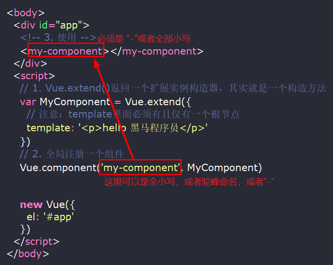

#### vue.component创建

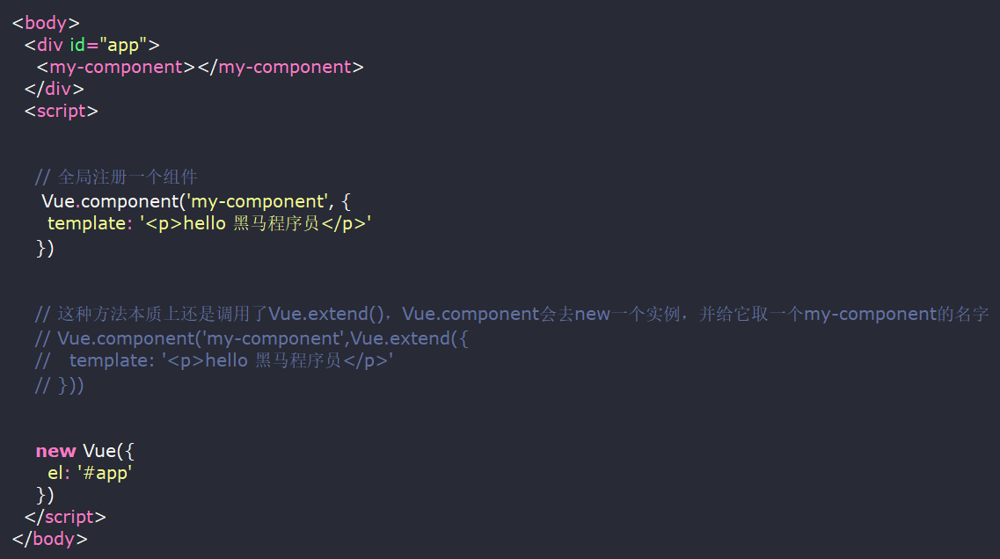

#### template方式创建

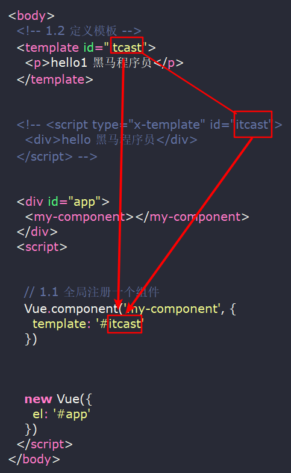

### 组件中的指令以及事件绑定

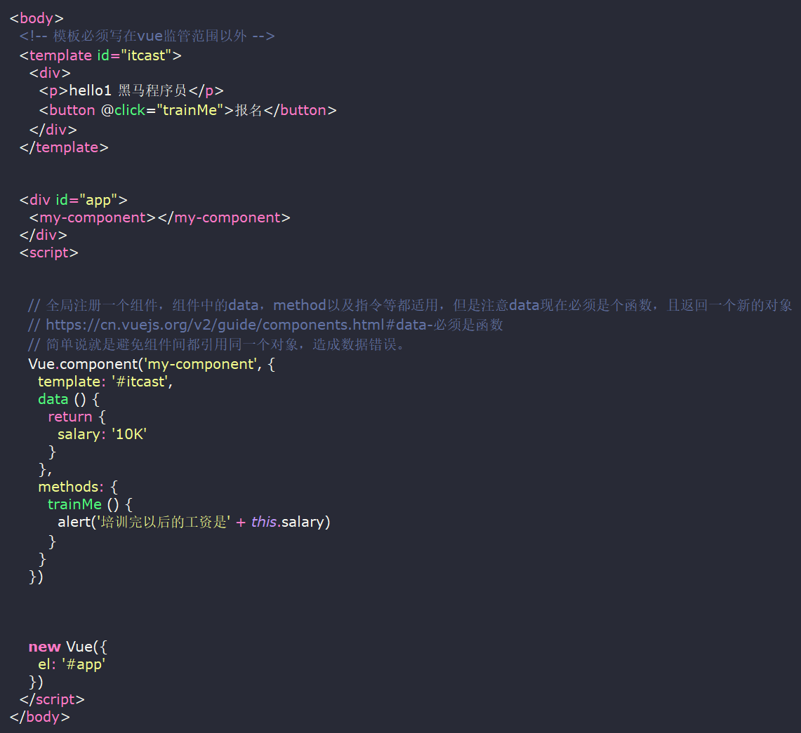

### 父子组件创建

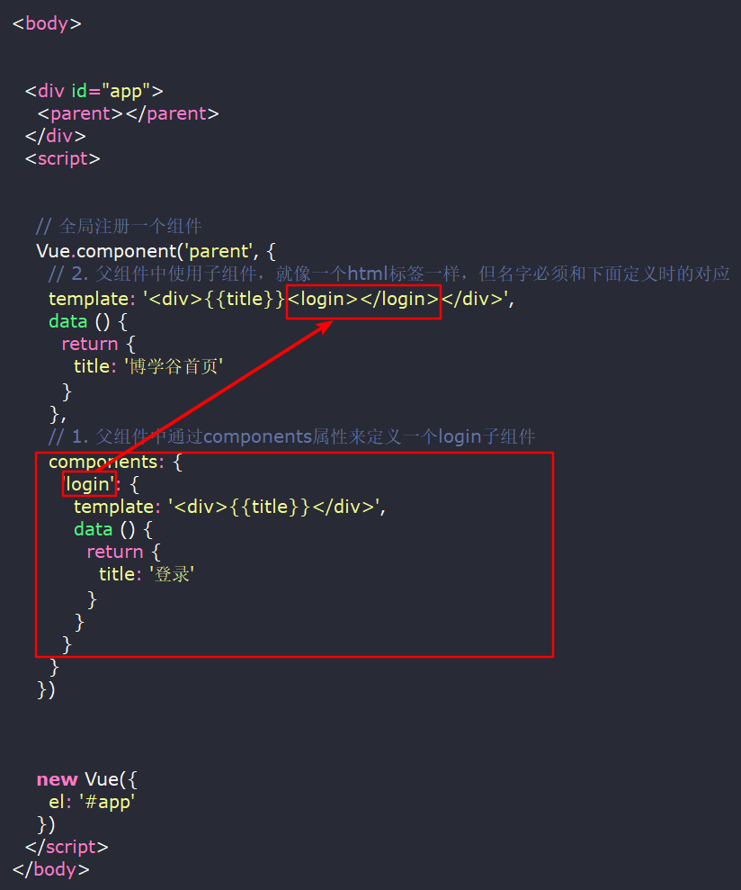

### 父子组件通信

#### 父组件传值给子组件(props)

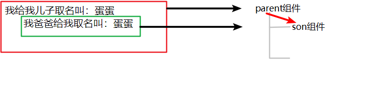

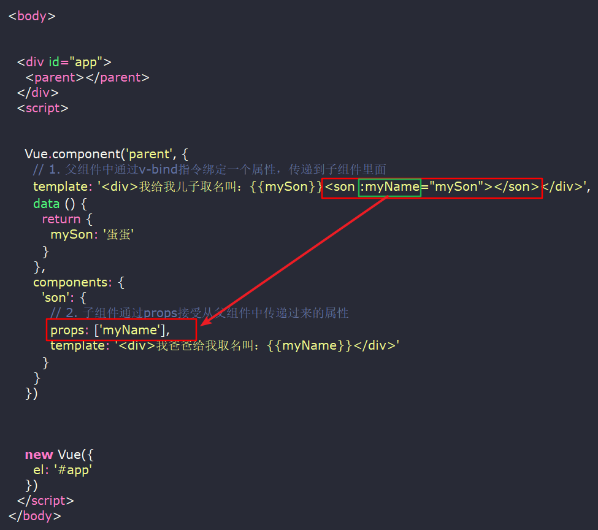

#### 子组件传值给父组件($emit)

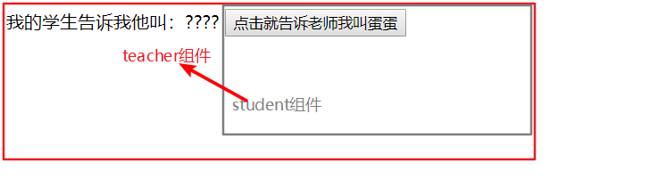

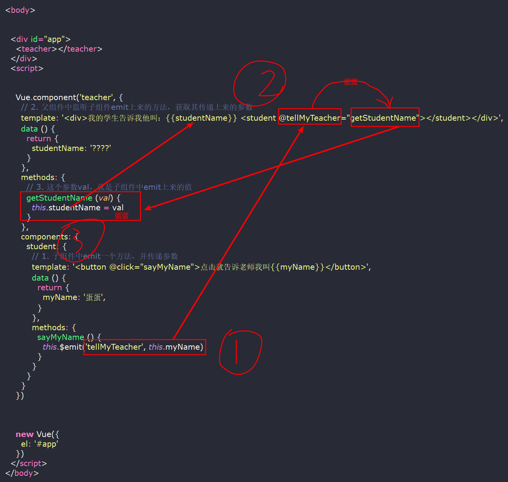

### 利用component组件和is属性实现动态组件

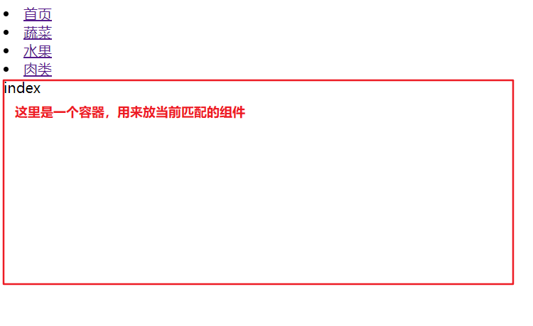


## 组件生命周期

```js
<body>
    <div id="app">
        <p>{{info}}</p>
        <button @click="info='hello1'">更新info</button>
        <button @click="destroy">销毁实例</button>
    </div>
    <script>
        var myVm = new Vue({
            el: "#app",
            data: {
                info: "hello"
            },
            // 在实例初始化之后，数据观测 (data observer) 和 event/watcher 配置之前被调用。
            beforeCreate: function () {
                console.log("===============beforeCreate============================================")
                // $el表示Vue 实例使用的根 DOM 元素。
                console.log('$el', this.$el);
                // $data Vue 实例观察的数据对象
                console.log('$data', this.$data);
                console.log("info:", this.info)
            },
            // 在实例创建完成后被立即调用。在这一步，实例已完成以下的配置：数据观测 (data observer)，属性和方法的运算，watch/event 事件回调。然而，挂载阶段还没开始，dom还未生成，$el 属性目前不可见。
            created: function () {
                console.log("===============created=======================================")
                console.log('$el', this.$el);
                console.log('$data', this.$data);
                console.log("info:", this.info)
            },
            // 模板编译挂载之前调用，首先会判断对象是否有el选项。如果有的话就继续向下编译，如果没有el选项，则停止编译，也就意味着停止了生命周期，直到在该vue实例上调用vm.$mount(el)。接着判断是否有template属性，有的话就以template属性中的值作为模板，如果没有的话，就以el属性指向的作为模板。这里会生成vm.$el，但指令尚未被解析
            beforeMount: function () {
                console.log("===============beforeMount=========================================")
                console.log('$el', this.$el);
                console.log('$data', this.$data);
                console.log("info:", this.info)
            },
            // 模板编译挂载之后调用，vm.$el替换掉el指向的dom
            mounted: function () {
                console.log("===============mounted===========================================")
                console.log('$el', this.$el);
                console.log('$data', this.$data);
                console.log("info:", this.info)
            },
            // 数据变更导致虚拟DOM重新渲染之前调用
            beforeUpdate: function () {
                console.log("===============beforeUpdate============================================");

            },
            // 数据变更导致虚拟DOM重新渲染之后调用
            updated: function () {
                console.log("===============updated======================================================");
            },
            // 实例销毁之前调用，在这一步，实例完全可用
            beforeDestroy: function () {
                console.log("===============beforeDestroy===============================================")
                console.log('$el', this.$el);
                console.log('$data', this.$data);
                console.log("info:", this.info)
            },
            // vue实例指向的所有东西解除绑定，包括watcher、事件、所以的子组件，后续就不再受vue实例控制了
            destroyed: function () {
                console.log("===============destroyed================================================")
                console.log('$el', this.$el);
                console.log('$data', this.$data);
                console.log("info:", this.info)
            },
            methods: {
                destroy() {
                    // 表示销毁组件
                    this.$destroy()
                },
                udpateinfo() {
                    this.info = 'hello2'
                }
            }
        })
    </script>
</body>
```

## vue-router(路由)

[vue-router文档](https://router.vuejs.org/zh-cn/)

  在一个系统中会由很多页面组成，在Vue开发中这些页面通常使用的是Vue中的组件来实现的，那么当在一个页面要跳转到另外一个页面的时候是通过改变url路径来实现的，那么这个时候Vue需要知道当前url对应的是哪个组件页面，这个控制着就是vue-router接下来，学习vue-router的相关写法,注意的是：vue-router 在vue2.0版本中做了很大的改动，所以要注意Vue的版本来选择预期对应的vue-router版本我们主讲vue-router2的使用

### vue-router入门

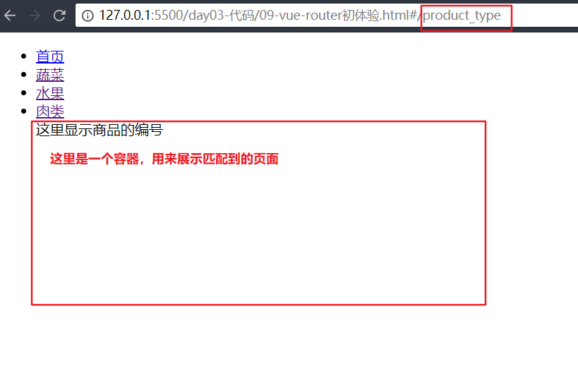
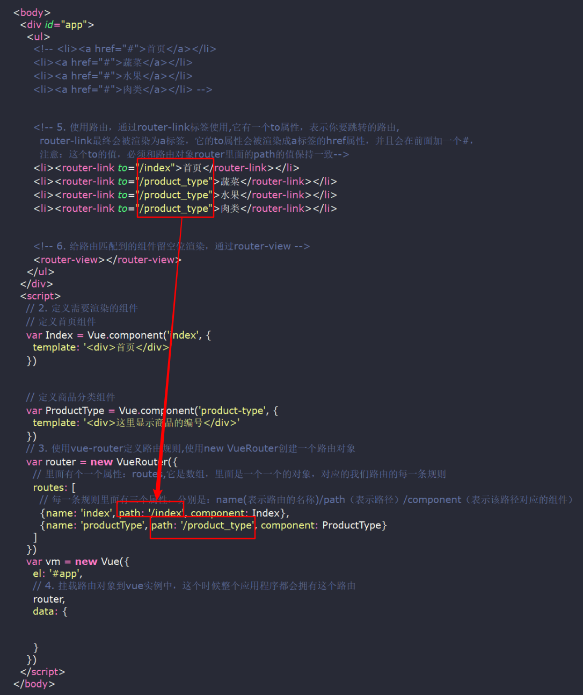

### vur-router传参

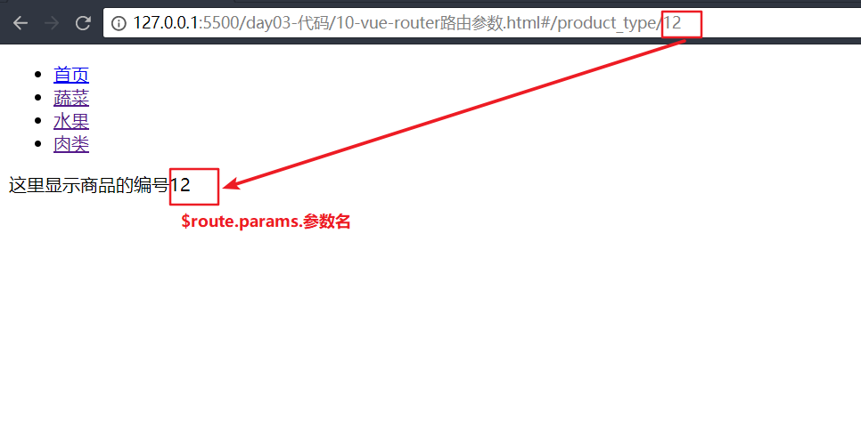

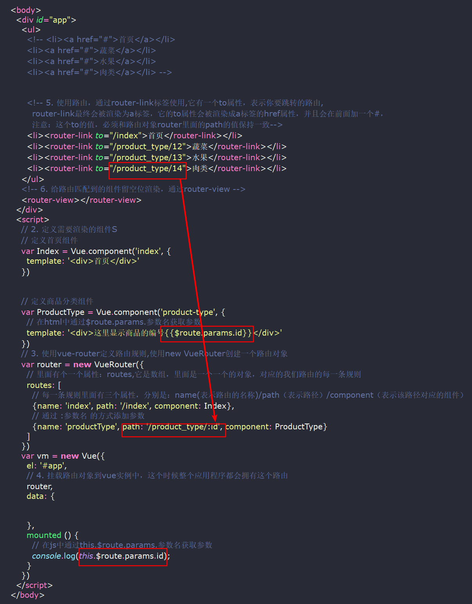

### vue-router嵌套

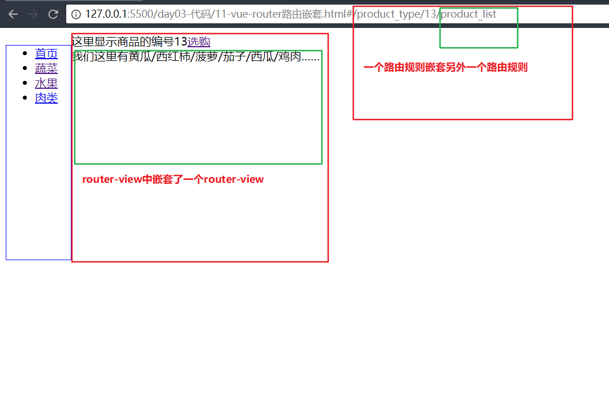

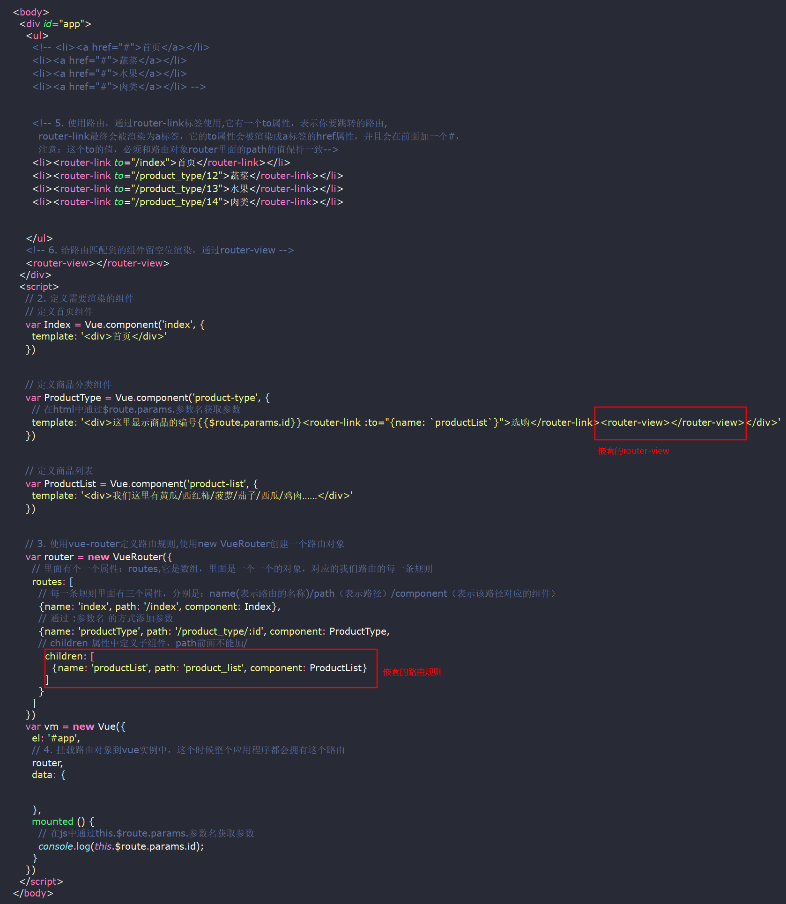


